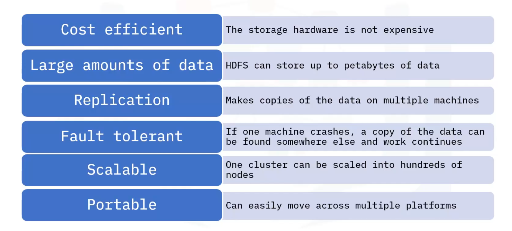
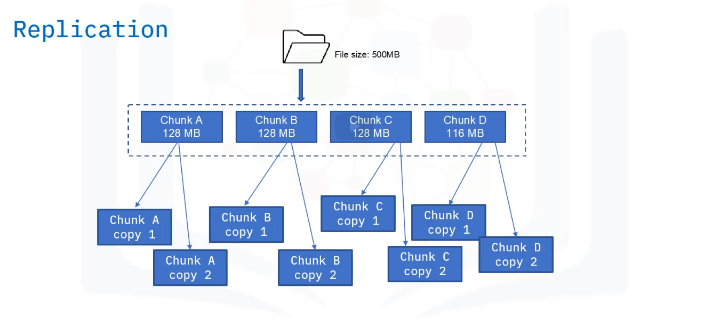
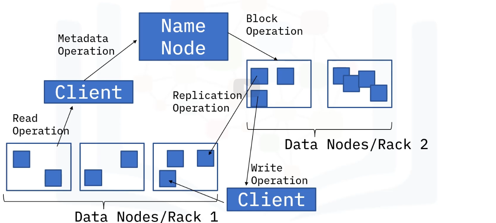

Is the storage layer of Hadoop.
Splits the files into blocks, creates replicas of the blocks, and stores them on different machines.
Provides access to streaming data.
Uses a command line interface to interact with Hadoop.

# Key features

# HDFS concepts

- Blocks:
When HDFS receives files, files are broken into smaller chunks called blocks.
Blocks are minimum of data that can be read or written.
Provides fault tolerance.
Default size is 64 MB or 128 MB.

- Nodes:
A node is a single system which is responsible to store and process data.
HDFS has two types of nodes:
=> Primary node: Regulates file access to the clients and maintain, manages, and assigns tasks to the secondary node.
=> Secondary node: can be a hundred of data nodes, Are the actual workers in HDFS system and take instructions from the primary node.

- Rack awareness in HDFS:
A rack is the collection of about 40 to 59 data nodes using the same network switch
Choosing data node racks that are closest to each other.
Improves cluster performance by reducing network traffic.
Name node keeps the rack ID information.

- Replication:
Ensure data is reliable and available.
Creating a copy of data block.
Copies are created for backup purposes.
Replication factor is number of times the data block was copied, depending on the configuration.

- Read and write operations:
HDFS allows WRITE ONCE READ MANY operations.
=> This means that you cannot edit files that are already stored in HDFS, but you can append new data to them.

# HDFS Architecture

