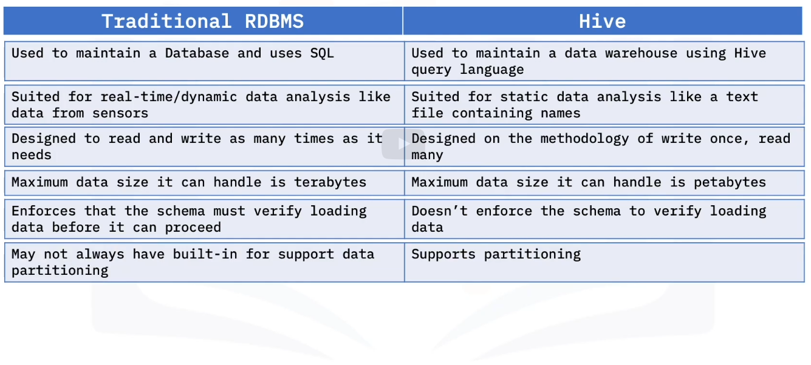
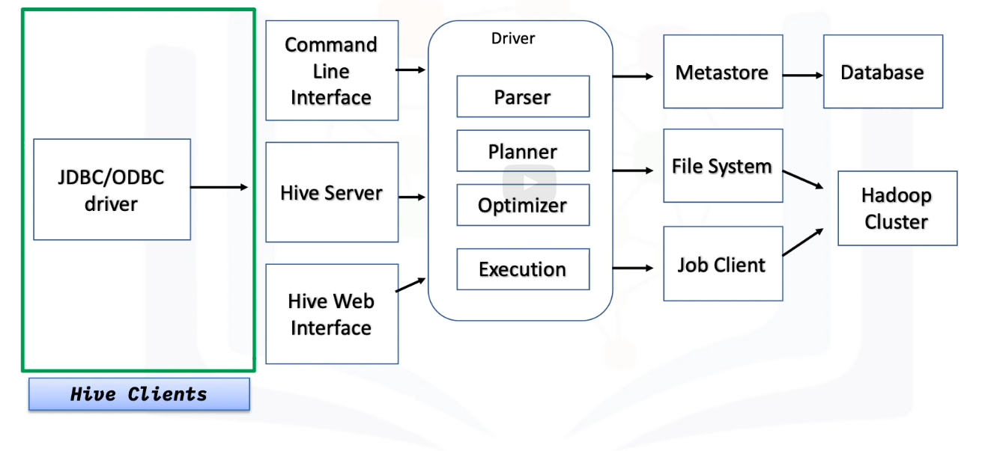

Is data warehouse software within Hadoop that is designed for reading, writing, and managing tabular-type datasets and data analysis.
Use Hive Query language or HIVE QL.
A data warehouse stores historical data from many different sources so that you can analyze and extract insights from it.

# Hive vs RDBMS 

# Hive architecture

