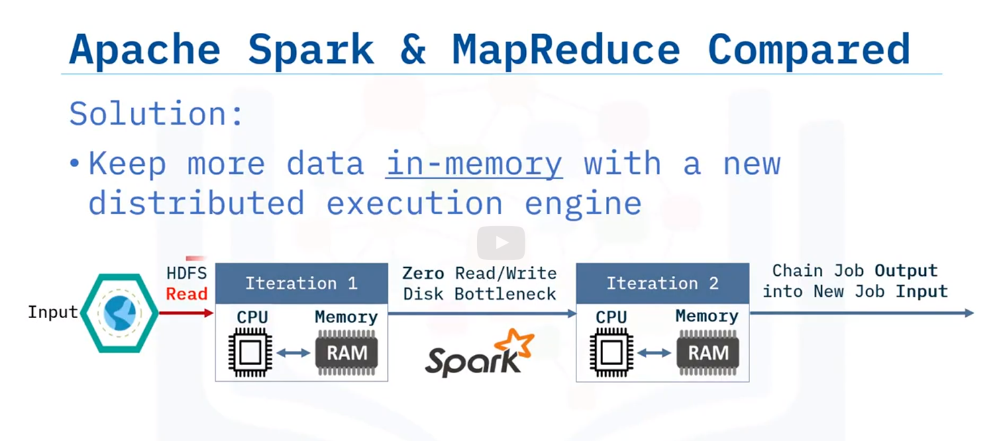

# Why use apache spark

Spark is an open source in-memory application framework for distributed data processing and iterative analysis on massive data volumes.

- in-memory: 
Which means that all operations happen within the memory or RAM.

Is written predominantly in Scala and runs on JVM.

# Apache Spark and MapReduce

