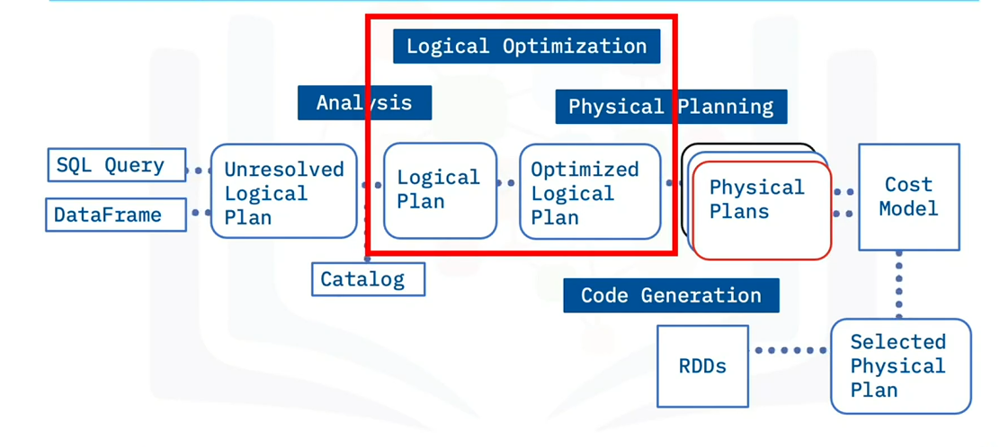

# Catalyst

Is the spark SQL built-in rule-based query optimizer.
Based on functional programming.
rule-based optimization => defines how to run the query

example:
Is the table is indexed?
Does the query contain only the required columns?

**catalyst query optimization**

Uses a tree data structure and a set of rules
Four major phases of query execution:

- Analysis
- Logistical optimization
- Physical planning
- Code generation

# Tungsten 

Spark's cost-based optimizer that maximizes CPU and memory performance.
For transactional applications.
