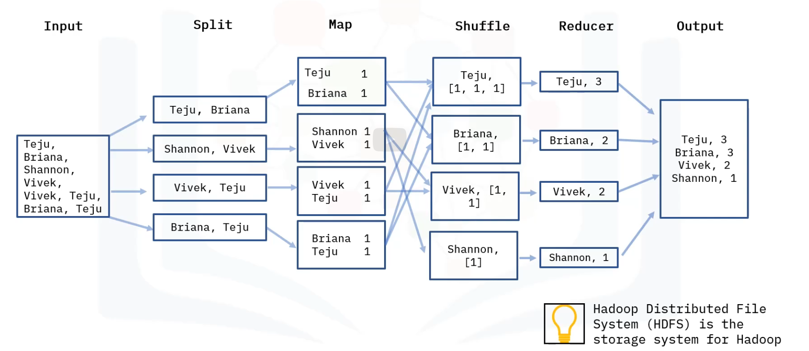

Is a programming model used in Hadoop cluster for processing big data.
Processing technique for distributed computing.
Consists of a map task and a Reduce task.
Can be coded in many programming languages like Java, C++, Python, Ruby and R.

- Map:
Takes an input file  and perform some mapping tasks by processing and extracting important data information into key value pairs.
Further data sorting and organizing.

- Reducer:
Aggregates and computes a set of result and produces a fine output.

MapReduce keeps track of its task by creating a unique key.

# How MapReduce works

