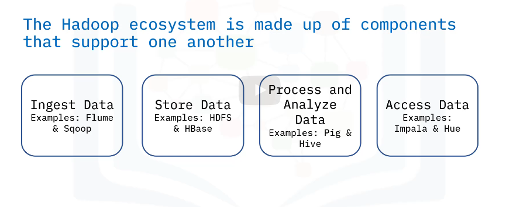

# Why hadoop

Hadoop is an open source framework used to process enormous data sets.
Imagine this scenario:
You have one gigabyte of data that you need to process, perhaps customer sales records or survey responses.
The data is stored in a relational database on your desktop computer or laptop.
Neither device has a problem handling this data set and you can query the data with ease.
Then the one gigabyte of data grown up due the increasing of user numbers.
=> Hadoop was designed to help organizations manage terabytes of data.
Used for processing large amounts of data.
Used for processing  massive data in distributed file systems that are linked together.

# How does Hadoop work?

Hadoop has individual components for storing and processing data.
- Storage component:
Hadoop Distributed File System (HDFS)
It handles and stores large amounts of data.

- MapReduce component:
Known as Hadoop's processing unit.
Processes big data by splitting the data into smaller units and processing them simultaneously.

- YARN component:
Short for "Yet Another Resource Negotiator"
It prepares the RAM and CPU for Hadoop to run data in batch processing, streaming processing, interactively processing, and graph processing.
=> Resource manager

# Ingest Data

You get data from different sources.
Then use tools like Flume and sqoop.
=> Collect, aggregate, and transfers big data to the storage system.
Flume has a simple and flexible architecture based on streaming data flows.

sqoop designed to transfer data between relational database system and hadoop.

# Store data

HBase: is a column-oriented non-relational database system that runs on top of HDFS.
Provides real-time wrangling on data
Stores data as indexes to allow for random and faster access data.
Cassandra either

# Analyze data

Pig: Analyzes large amounts of data.
Operates on the client side of a cluster.
A procedural data flow language.

Hive: Used for creating reports.
Operates on the server side of a cluster
A declarative programming language.

# Access data

Where users have access to analyzed and refined.

Impala: Scalable and easy to use platform for everyone.

Hue : another choice