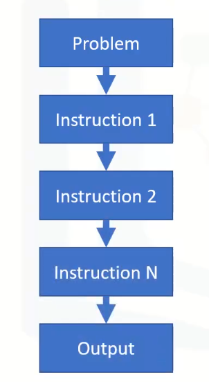
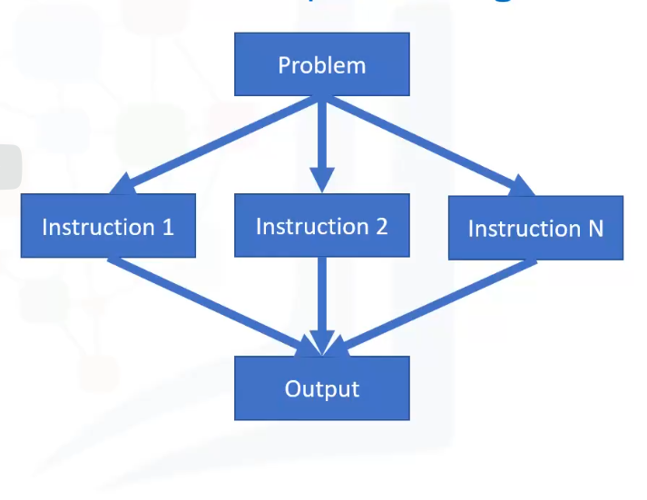

# Why parallel processing

In any normal analytics cycle, the functionality of the computer is to store data and move that data from its storage capacity into compute capacity (which include memory), and back to storage once important results are computed.

- Linear processing: is the traditional method of computing a problem where the problem statement is broken into a set of instructions that are executed sequentially.

- Parallel processing:

The problem is broken down into a set of executable instructions.
The instructions are then distributed to multiple execution nodes of equal processing power and are executed in parallel.

- Parallel processing advantages for big data:

Can process a large data sets in a fraction of time.
Less memory and compute requirements needed as set of instructions are distributed to smaller execution nodes.

# Data scaling in Big data

Increasing the capacity of a single node.
Horizontal scaling
Vertical scaling

# Data locality

