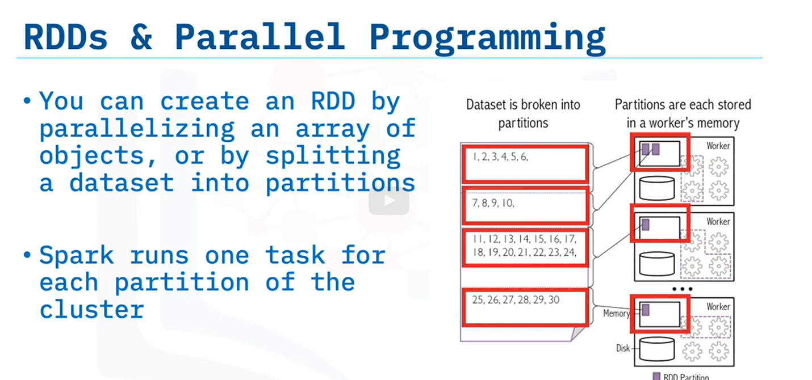

# What are Resilient distributed datasets (RDDs)

Spark's primary data abstraction
A fault-tolerant collection of elements
Partitioned across the nodes of the cluster.
Capable of accepting parallel operations
Immutable 

# Spark applications

Consist of a driver program that runs the user's main functions and multiple parallel operations on a cluster.

RDD support text files, sequenceFiles, Avro, Parquet, Hadoop input formats

# Parallel programming

Like distributed programming, is the simultaneous use of multiple compute resources to solve a computational problem.
Breaks problems into discrete parts that can be solved concurrently.
Runs multiple instructions on multiple processors.

# RDDs and parallel programming

