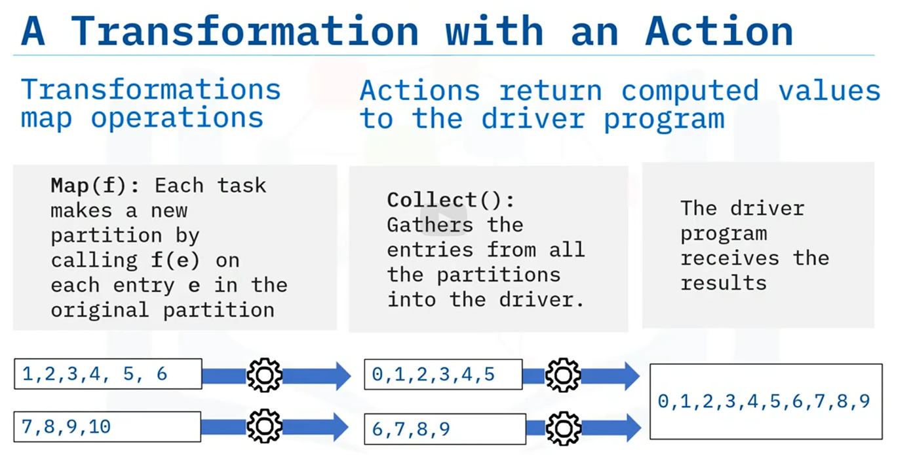

Welcome to "Resilient Distributed Datasets in Parallel Programming and Spark."
After watching this video, you will be able to:
Describe Resilient Distributed Datasets
Explain how to use Resilient Distributed Datasets in Spark
Explain RDD transformation and actions and list fundamental transformations and actions
Resilient Distributed Datasets, known as RDDs, are Spark's primary data abstraction and are
partitioned across a cluster's nodes.
The first RDD operation to explore is a Transformation. An RDD transformation creates a new RDD from
an existing RDD.
Transformations in Spark are considered lazy because Spark does not compute transformation
results immediately. Instead, the results are only computed when evaluated by "actions."
For example, the map transformation passes each element of a dataset through a function
resulting in a new RDD.
To evaluate a transformation in Spark, you use an action. The action returns a value
to the driver program after running a computation.
One example is the reduce action, which aggregates all the elements of an RDD and returns the
result to the driver program.
But how do transformations and actions happen? Spark uses a unique data structure called
a Directed Acyclic Graph, knowns as a DAG, and an associated DAG Scheduler to perform
RDD operations.
Think of a DAG as a graphical structure composed of edges and vertices.
The term "acyclic" means that new edges only originate from an existing vertex.
In general, the vertices and edges are sequential.
The vertices represent RDDs, and the edges represent the transformations or actions.
The DAG Scheduler applies the graphical structure to run the tasks that use the RDD to perform
transformation processes.
So, why does Spark use DAGs? DAGS help enable fault tolerance.
When a node goes down, Spark replicates the DAG and restores the node.
Let's look at the process in more detail.
First, Spark creates DAG when creating an RDD.
Next, Spark enables the DAG Schedular to perform a transformation and updates the DAG.
The DAG now points to the new RDD.
The pointer that transforms RDD is returned to the Spark driver program.
And, if there is an action, the driver program that calls the action evaluates the DAG only
after Spark completes the action.
Here are some examples of RDD transformations and actions.
We have already mentioned, map, which is an essential operation and capable of expressing
all transformations needed in data science.
Some of the more common high-level transformations making use of map and reduce include
filter, which enables filtering the elements of a dataset based on a function, and distinct,
which finds the number of distinct elements in a dataset.
In addition, the flatmap transformation, which is similar to the map transformation, can
map each input item to zero or greater output items.
Its function should return a sequence rather than a single item.
Next, frequently used actions include:
reduce, which aggregates dataset elements using the function func.
take, which returns an array with the first n element,
collect, which returns all the elements of the dataset as an array and
takeOrdered, which returns elements ordered in ascending order or as specified by an optional
function argument.
You can find more details about transformations and actions, on the spark dot apache dot org
website.
A transformation is only a mapping of operations. You need actions to get the computed values
to the driver program:
This example considers a function f of x that decrements x by 1. So, f of x equals x minus
1.
You'll apply this function as a transformation to a dataset using the map transformation.
Each task makes a new partition by calling f of e on each entry e in the original partition.
Then, the collect action gathers the entries from all the partitions into the driver, which
receives the results.
In this video, you learned that:
RDDs are Spark's primary data abstraction partitioned across the nodes of the cluster.
Spark uses DAGS to enable fault tolerance. When a node goes down, Spark replicates the
DAG and restores the node.
Transformations leave existing RDDs intact and create new RDDs based on the transformation
function.
Transformations undergo lazy evaluation, meaning they are only evaluated when the driver
function calls an action.

