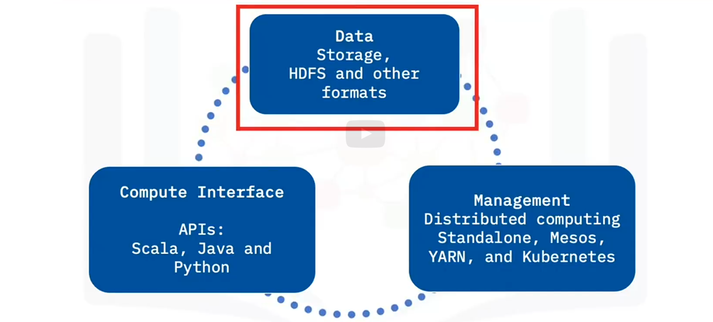
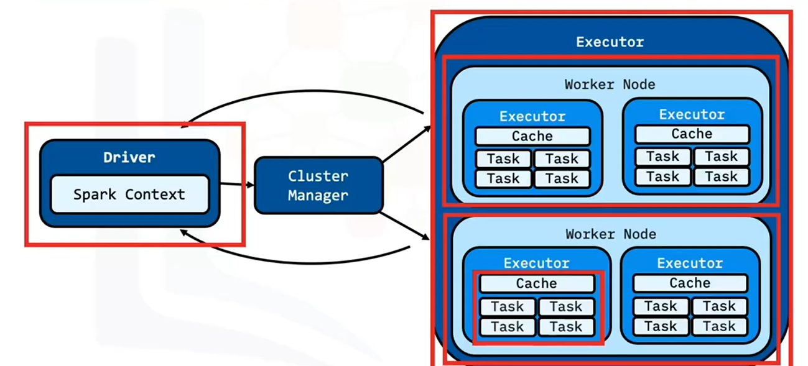

# Apache spark components

# Spark core

Is a base engine
Performs large scale parallel and distributed data processing
Manages memory
Task scheduling
Houses APIs
 
# Scaling big data in spark

Welcome to “Scale out and Data Parallelism in Apache Spark”
After watching this video, you will be able to:
Describe Apache Spark components.
Describe how Apache Spark scales with big data.
Apache Spark architecture consists of three main components.
The first component is data storage. Datasets load from data storage into memory.
Any Hadoop compatible data source is acceptable.
High-level programming APIs comprise the second component.
Spark has APIs in Scala, Python, and Java.
The final component is the cluster management framework,
which handles the distributed computing aspects of Spark.
Spark’s cluster management framework can exist as a stand-alone server,
Mesos or Yet Another Resource Network, or YARN.
A cluster management framework is essential for scaling big data.
Here is a simple visualization of the three pieces.
The data from a Hadoop file system flows into the compute interface or API,
which then flows into different nodes to perform distributed/parallel tasks.
What is often referred to as “Spark” is the base engine formally called the “Spark Core.”
The fault-tolerant Spark Core is the base engine
for large-scale parallel and distributed data processing.
Spark Core manages memory and task scheduling.
Spark Core also contains the APIs used to define RDDs and other datatypes.
Spark Core also parallelizes a distributed collection of elements across the cluster.
To understand how Spark scales with big data, let’s review the Spark Application Architecture.
The Spark Application consists of the driver program and the executor program.
Executor programs run on worker nodes.
Spark can start additional executor processes on a worker
if there is enough memory and cores available.
Similarly, executors can also take multiple cores for multithreaded calculations.
Spark distributes RDDs among executors.
Communication occurs among the driver and the executors. The driver contains the Spark jobs
that the application needs to run and splits the jobs into tasks submitted to the executors.
The driver receives the task results when the executors complete the tasks.
If Apache Spark were a large organization or company,
the driver code would be the executive management of that company that makes
decisions about allocating work, obtaining capital, and more.
The junior employees are the executors who do the jobs assigned to them with the resources provided.
The worker nodes correspond to the physical office space that the employees occupy.
You can add additional worker nodes to scale big data processing incrementally.
In this video, you learned that:
Apache Spark architecture consists of three main pieces
components data, compute input, and management.
The fault-tolerant Spark Core base engine performs large-scale parallel and distributed
data processing, manages memory, schedules tasks, and houses APIs that define RDDs.
The Spark driver program communicates with the cluster
and then distributes RDDs among worker nodes.