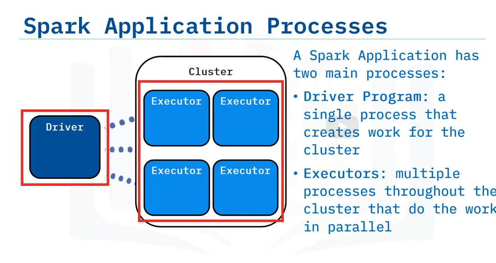
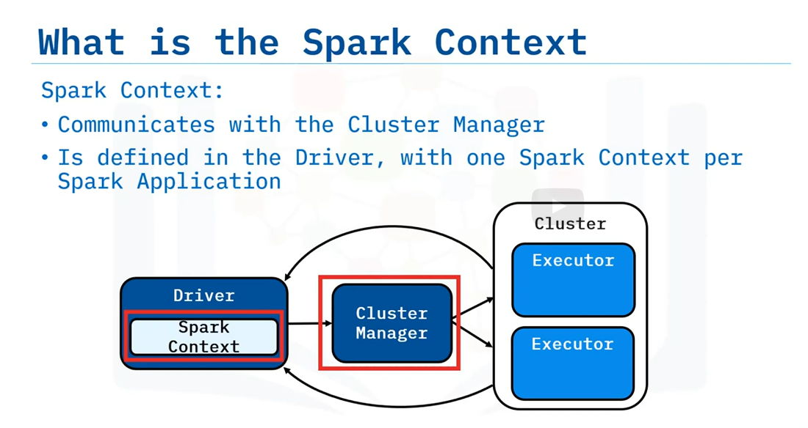
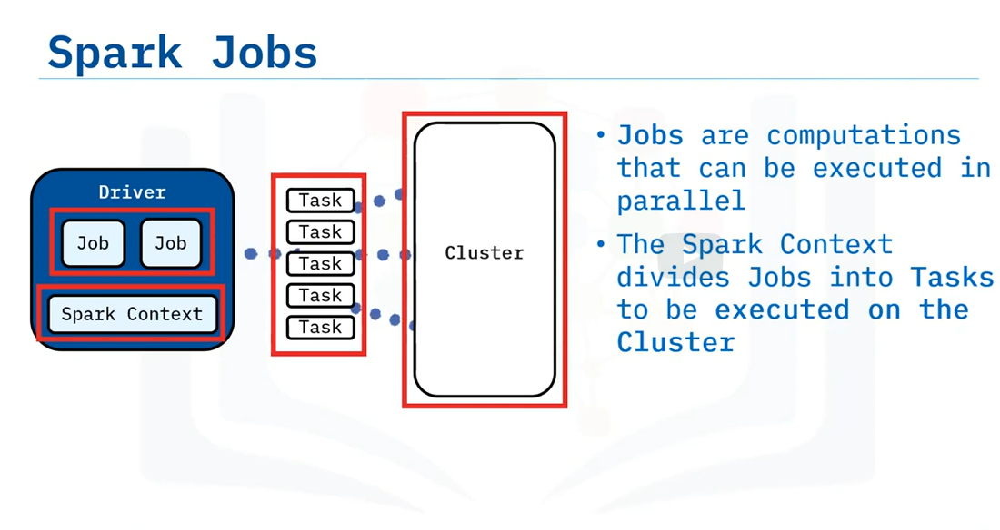
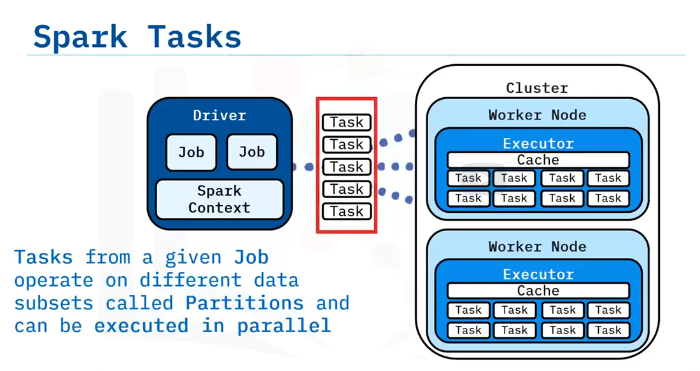
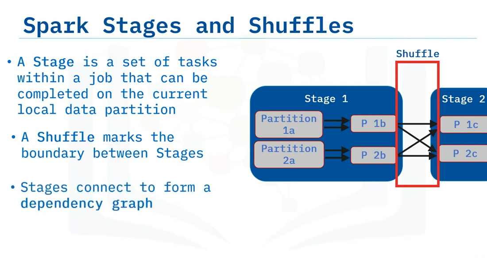

# Spark context

# Spark jobs

# Spark tasks

# Spark executors run tasks from a job

A worker is a cluster node that can launch executor processes to run tasks.
Each executor is allotted a set number of cores that each run one task at a time.
Increasing executors and cores increases cluster parallelism

# Spark stages and shuffles

