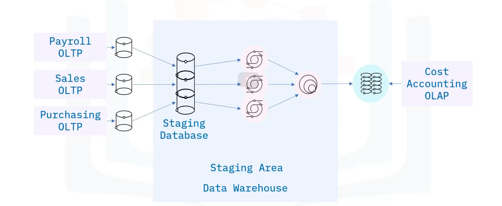

A staging area is:
Intermediate storage for ETL processing.
Bridge between data sources and the target system.
sometimes transient
Sometimes held for archiving ot troubleshooting
Used to optimize and monitor ETL jobs

Staging areas can be implemented as:
Simple flat files such as csv files, stored in directory using tools such as python or bash scripting.
A set of SQL tables in a relational DB

**Data warehouse staging area example**

# Functions of staging area

Integration
Change detection
Scheduling
Cleansing data
Aggregating data
Normalization

We use staging area to :
Separate location where data from source systems is extracted to
Decouples operations such as validation, cleansing and other processes.
Minimizes corruption risk
Simplifies ETL workflow.
Simplifies recovery
