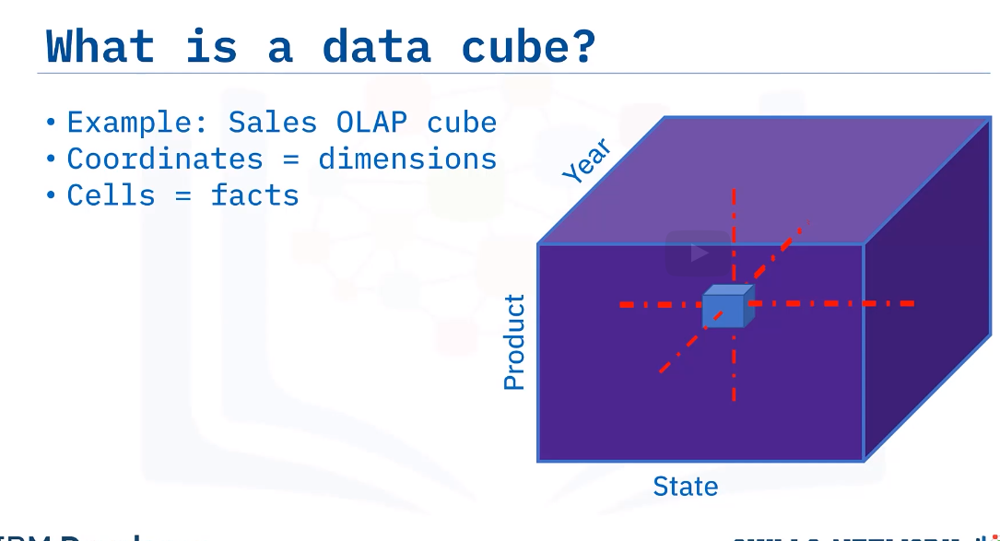
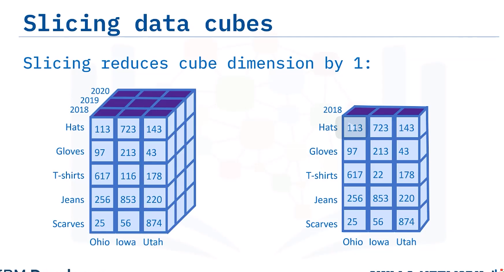
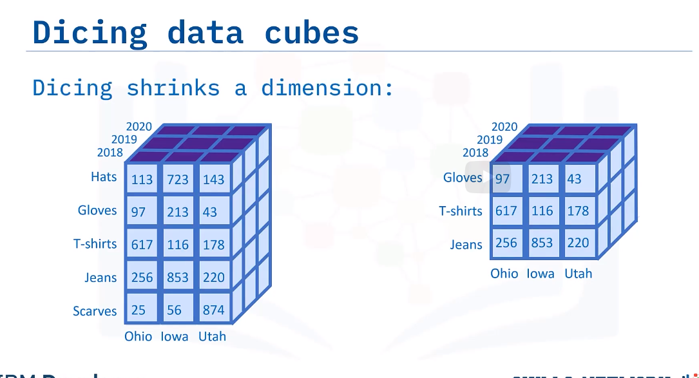
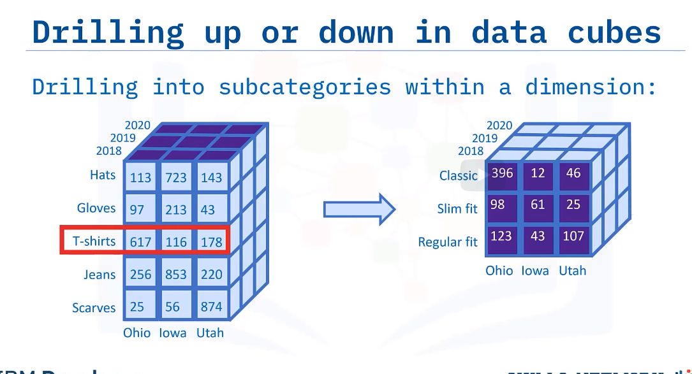
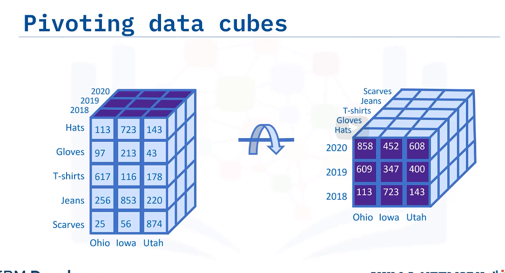
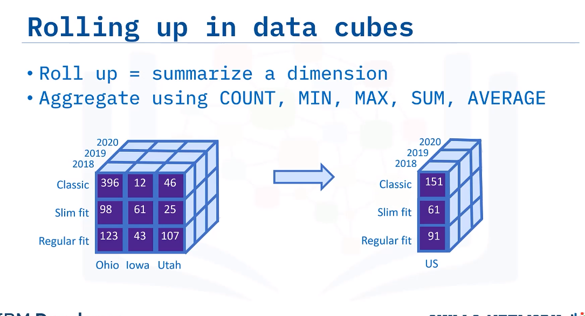

# Data cube

The coordinates of the cube are defined by a set of dimensions, which are selected from the start schema.
Data cubes can have many dimensions.
Cells : Facts

**Cube operations**
- Slicing:
Slicing a data cube involves selecting a single member from a dimension, which yield a data cube that has one dimension less than the original.

- Dicing:
Involves selecting a subset of values from a dimension, effectively shrinking it

- Drilling up or down
Drilling into sub-categories within a dimension
Take you back to the original data cube.

- Pivoting
Is straightforward.
It involves a rotation of the data cube.
It just changes the point of view

- Rolling up
Summarizes a dimension.
You can roll up a dimension by applying aggregations, such as
COUNT, MIN, MAX, SUM, and AVERAGE.
For example, you could calculate the average selling price of Classic, Slim fit, and Regular
fit T-shirts by summing horizontally over the three US states and dividing by three.

# Materialized view

A snapshot containing results of a query.
Used to replicate data.
Pre-compute expensive queries for a data warehouse

**Create a materialized view in oracle**

CREATE MATERIALIZED VIEW MY_MAT_VIEW
REFRESH FAST START WITH SYSDATE
NEXT SYSDATE + 1
AS SELECT * FROM <my_table_name>;

Check in postgresql, db2, and mysql
