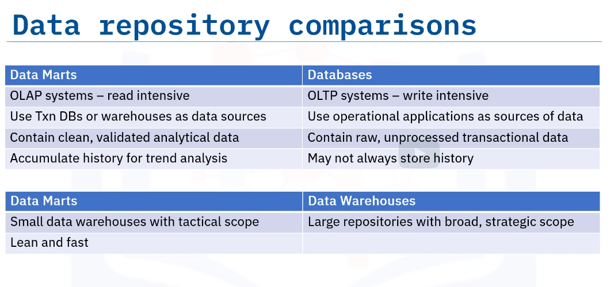

Is an isolated part of the larger enterprise data warehouse that is specifically built to server a particular business function, purpose, or community of users.
For example: Sales and financial departments
Marketing team

Data marts designed to provide support for tactical decision-making.
HElp end users focus only on relevant data.

# Data marts structure

Relational database
Star or snowflake schema.
Central fact table of business metrics

