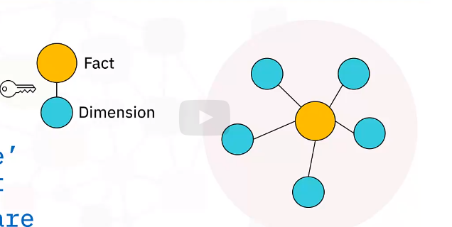
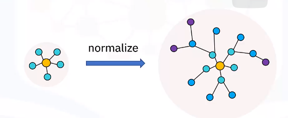
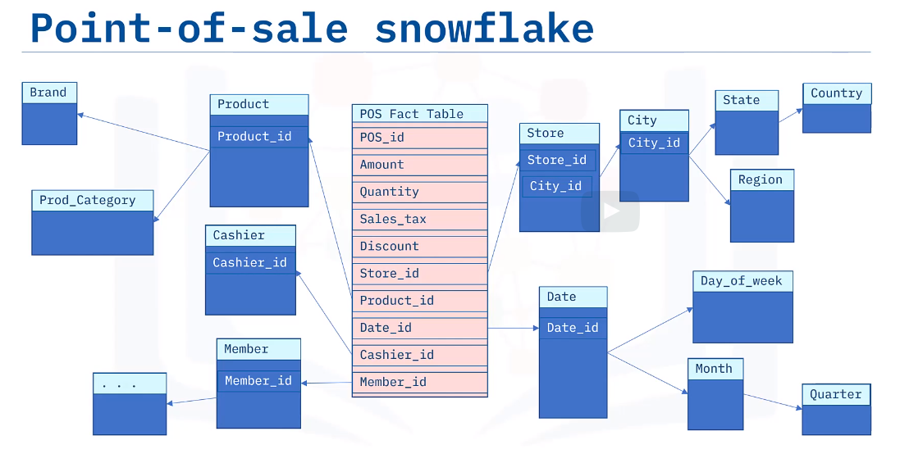

# Star schemas

Keys connect facts with dimensions
Dimensions 'radiate' from a central fact.
Graph whose edges are relations between facts and dimensions

Star schemas are commonly used to develop specialized data warehouses called "data marts".

# Snowflake schemas

Are normalized star schemas.
Dimension tables split into child tables.
Snowflakes don't need to be fully normalized.

# Modeling with star schemas

- Design considerations
Select a business process
Choose level of details
Identify the dimensions
Identify the facts

