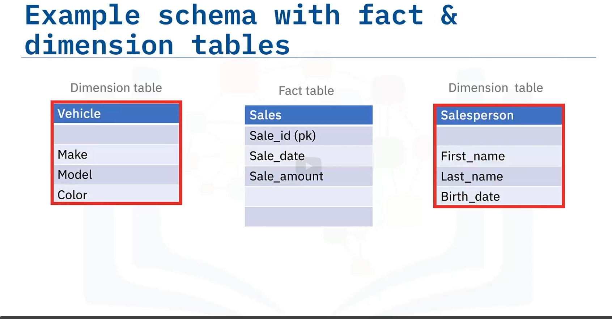
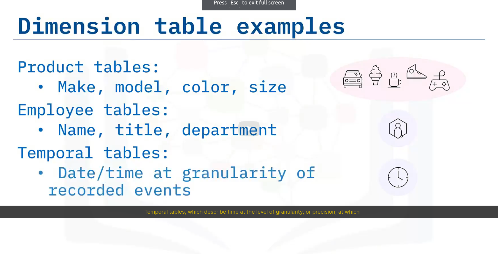

Show drafts
volume_up
Facts and Dimensions in Data Modeling
In the field of data warehousing and business analytics, dimensional modeling is a fundamental approach to organizing and representing data in a structured and efficient manner. It is based on two key concepts: facts and dimensions .

Facts represent the quantifiable numerical measurements that we wish to analyze. These are the values ​​that describe events or transactions within a system. For example, in the case of an e-commerce site, the facts could include the selling price of a product, the quantity sold, shipping costs, etc.

Dimensions , on the other hand, provide context and descriptive attributes that enrich the facts. They make it possible to qualify and categorize measurements by associating them with descriptive information. For example, for an e-commerce site's sales facts, dimensions could include date of sale, customer ID, product purchased, geographic region, etc.

Combining facts and dimensions creates a multidimensional data model that reflects the richness and complexity of the raw data. This model facilitates the analysis and understanding of data by allowing it to be explored from different perspectives and identifying relevant trends or patterns.

Types of facts

We generally distinguish three types of facts based on their computational properties:

Additive facts: These facts can be aggregated by adding them together, such as the number of sales or total revenue.
Semi-additive facts: These facts can be aggregated under certain conditions, but require additional manipulation before totals are calculated, such as sales prices with discounts applied.
Non-additive facts: These facts cannot be meaningfully aggregated, like unique identifiers or dates.
Organizing facts and dimensions

Facts and dimensions are usually organized in star or snowflake structures:

Star Model: A central fact table is linked to several dimension tables by foreign keys. This model is simple and intuitive, but may become less efficient for complex analyses.
Snowflake Model: Satellite dimension tables are connected to higher-level dimension tables, creating a more granular hierarchy. This model provides more flexibility for hierarchical analyses, but can be more complex to design and manage.
Benefits of dimensional modeling

Dimensional modeling offers many advantages for data analysis:

Simplicity and understandability: Represents data in a clear and intuitive way, making it easier for business users to understand the model.
Flexibility: Allows you to explore data along different dimensions and ask complex questions.
Analysis Efficiency: Optimizes queries and analyzes by organizing data in a structured way.
Informed Decision Making: Facilitates the identification of trends, patterns and anomalies in data, enabling more informed decision making.
Dimensional modeling is an essential tool for data analysts and business intelligence professionals. It transforms raw data into actionable information, thus promoting better understanding of activities and more effective decision-making.

Data can be categorized as facts and dimensions.

- Facts are usually measured quantities, such as temperature, number of sales, or mm of rainfall.
Facts can also be qualitative.

- Dimensions are attributes relating to facts.
Dimensions provide context to facts.

Each facts table typically has multiple dimension tables related to it
# Fact tables

Facts of a business process, plus foreign keys to dimension tables (dollar amounts for sales transactions)
Can contain detail level facts, or 
Facts that have been aggregated.
Summary tables contain aggregated facts ("quarterly sales", summary table,)

