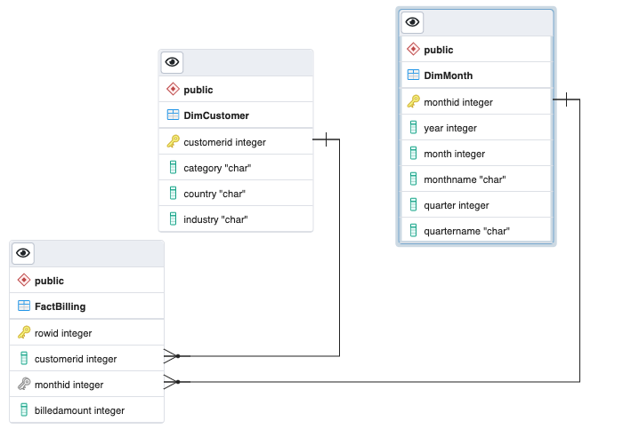

# Study the schema of the given csv file

In this lab, we will design a data warehouse for a cloud service provider.

The cloud service provider has given us their billing data in the csv file cloud-billing-dataset.csv. This file contains the billing data for the past decade.

Here are the field wise details of the billing data.

Field Name	Details
customerid	Id of the customer
category	Category of the customer. Example: Individual or Company
country	Country of the customer
industry	Which domain/industry the customer belongs to. Example: Legal, Engineering
month	The billed month, stored as YYYY-MM. Example: 2009-01 refers to the month January in the year 2009
billedamount	Amount charged by the cloud services provided for that month in USD
We need to design a data warehouse that can support the queries listed below:

average billing per customer
billing by country
top 10 customers
top 10 countries
billing by industry
billing by category
billing by year
billing by month
billing by quarter
average billing per industry per month
average billing per industry per quarter
average billing per country per quarter
average billing per country per industry per quarter
Here are five rows picked at random from the csv file.

Five rows from csv file

# Design the fact tables

The fact in this data is the bill which is generated monthly.

The fields customerid and billedamount are the important fields in the fact table.

We also need a way to identify the additional customer information, other than the id, and date information. So we need fields that refer to the customer and date information in other tables.

The final fact table for the bill would look like this:

Field Name	Details
billid	Primary key - Unique identifier for every bill
customerid	Foreign Key - Id of the customer
monthid	Foreign Key - Id of the month. We can resolve the billed month info using this
billedamount	Amount charged by the cloud services provided for that month in USD

# Design the dimension tables

There are two dimensions to our fact(monthly bill).

Customer information
Date information
Let us organize all the fields that give information about the customer into a dimension table.

Field Name	Details
customerid	Primary Key - Id of the customer
category	Category of the customer. Example: Individual or Company
country	Country of the customer
industry	Which domain/industry the customer belongs to. Example: Legal, Engineering
Let us organize or derive all the fields that give information about the date of the bill.

Field Name	Details
monthid	Primary Key - Id of the month
year	Year derived from the month field of the original data. Example: 2010
month	Month number derived from the month field of the original data. Example: 1, 2, 3
monthname	Month name derived from the month field of the original data. Example: March
quarter	Quarter number derived from the month field of the original data. Example: 1, 2, 3, 4
quartername	Quarter name derived from the month field of the original data. Example: Q1, Q2, Q3, Q4

# Create a start schema using the fact and dimension tables

Based on the previous two exercises, we have now arrived at 3 tables, we can name them as in the table below.

Table Name	Type	Details
FactBilling	Fact	This table contains the billing amount, and the foreign keys to customer and month data
DimCustomer	Dimension	This table contains all the information related the customer
DimMonth	Dimension	This table contains all the information related the month of billing
When we arrange the above tables in Star Schema style, we get a table strucutre that looks likes the one in the image below.

# Create the schema on the data warehouse

Run the commands below on the newly opened terminal. (You can copy the code by clicking on the little copy button on the bottom right of the codeblock below and then paste it, wherever you wish.)

Start the PostgreSQL server, by running the command below:

1
start_postgres
Copied!Executed!
You should see an output similar to the one below.

Screenshot of output

Step 2: Create the database on the data warehouse.

Using the createdb command of the PostgreSQL server, we can directly create the database from the terminal.

Run the command below to create a database named billingDW.

1
createdb -h localhost -U postgres -p 5432 billingDW
Copied!Executed!
In the above command

-h mentions that the database server is running on the localhost
-U mentions that we are using the user name postgres to log into the database
-p mentions that the database server is running on port number 5432
You should see an output like this.

Screenshot of output showing h, U, p

Step 3: Download the schema .sql file.

The commands to create the schema are available in the file below.

https://cf-courses-data.s3.us.cloud-object-storage.appdomain.cloud/IBM-DB0260EN-SkillsNetwork/labs/Working%20with%20Facts%20and%20Dimension%20Tables/star-schema.sql

Download the file by running the command below.

1
wget https://cf-courses-data.s3.us.cloud-object-storage.appdomain.cloud/IBM-DB0260EN-SkillsNetwork/labs/Working%20with%20Facts%20and%20Dimension%20Tables/star-schema.sql
Copied!Executed!
Step 4: Create the schema

Run the command below to create the schema in the under billingDW database.

1
psql  -h localhost -U postgres -p 5432 billingDW < star-schema.sql
Copied!Executed!
You should see an output similar to the one below.

