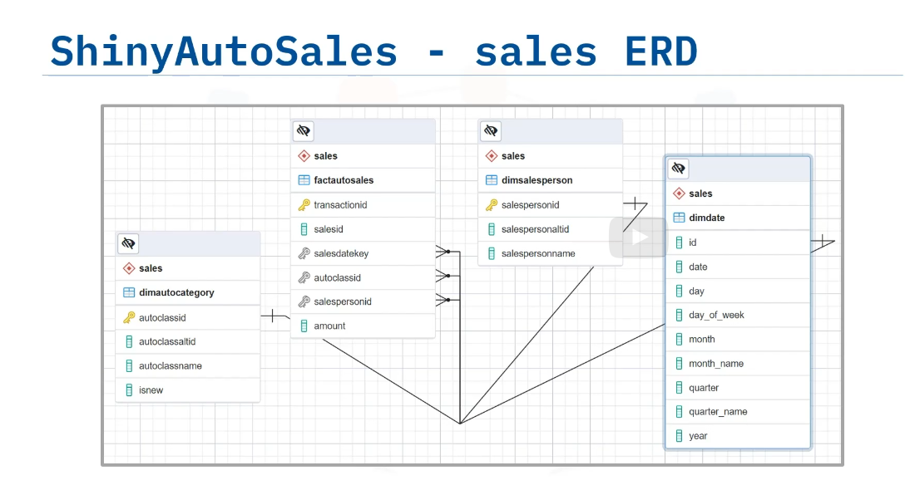

Use join
Create views
Normalize

Exercise 1 - Login to your Cloud IBM DB2
This lab requires that you complete the previous lab Populate a Data Warehouse.

If you have not finished the Populate a Data Warehouse Lab yet, please finish it before you continue.

GROUPING SETS, CUBE, and ROLLUP allow us to easily create subtotals and grand totals in a variety of ways. All these operators are used along with the GROUP BY operator.

GROUPING SETS operator allows us to group data in a number of different ways in a single SELECT statement.

The ROLLUP operator is used to create subtotals and grand totals for a set of columns. The summarized totals are created based on the columns passed to the ROLLUP operator.

The CUBE operator produces subtotals and grand totals. In addition it produces subtotals and grand totals for every permutation of the columns provided to the CUBE operator.

Exercise 2 - Write a query using grouping sets
After you login to the cloud instance of IBM DB2, go to the sql tab and run the query below.

To create a grouping set for three columns labeled year, category, and sum of billedamount, run the sql statement below.

1
2
3
4
5
6
7
8
select year,category, sum(billedamount) as totalbilledamount
from factbilling
left join dimcustomer
on factbilling.customerid = dimcustomer.customerid
left join dimmonth
on factbilling.monthid=dimmonth.monthid
group by grouping sets(year,category)
order by year, category
Copied!
The output of the above command will contain 13 rows. The partial output can be seen in the image below.

To see the full output click on the open in the new tab icon.

Screenshot highlighting Run all button and separate page icon

Exercise 3 - Write a query using rollup
To create a rollup using the three columns year, category and sum of billedamount, run the sql statement below.

1
2
3
4
5
6
7
8
select year,category, sum(billedamount) as totalbilledamount
from factbilling
left join dimcustomer
on factbilling.customerid = dimcustomer.customerid
left join dimmonth
on factbilling.monthid=dimmonth.monthid
group by rollup(year,category)
order by year, category
Copied!
The output of the above command will contain 408 rows. The partial output can be seen in the image below.

To see the full output click on the open in the new tab icon.

Screenshot of partial output for query using rollup

Exercise 4 - Write a query using cube
To create a cube using the three columns labeled year, category, and sum of billedamount, run the sql statement below.

1
2
3
4
5
6
7
8
select year,category, sum(billedamount) as totalbilledamount
from factbilling
left join dimcustomer
on factbilling.customerid = dimcustomer.customerid
left join dimmonth
on factbilling.monthid=dimmonth.monthid
group by cube(year,category)
order by year, category
Copied!
The output of the above command will contain 468 rows. The partial output can be seen in the image below.

To see the full output click on the open in the new tab icon.

Screenshot of partial output for query using cube

Exercise 5 - Create a Materialized Query Table(MQT)
In DB2 we can implement materialized views using Materialized Query Tables.

Step 1: Create the MQT.

Execute the sql statement below to create an MQT named countrystats.

1
2
3
4
5
6
7
8
9
10
11
CREATE TABLE countrystats (country, year, totalbilledamount) AS
  (select country, year, sum(billedamount)
from factbilling
left join dimcustomer
on factbilling.customerid = dimcustomer.customerid
left join dimmonth
on factbilling.monthid=dimmonth.monthid
group by country,year)
     DATA INITIALLY DEFERRED
     REFRESH DEFERRED
     MAINTAINED BY SYSTEM;
Copied!
You may get a warning in the output as below.

The materialized query table may not be used to optimize the processing of queries.

You can safely ignore the warning and proceed to the next step.

The above command creates an MQT named countrystats that has 3 columns.

country
year
totalbilledamount
The MQT is essentially the result of the below query, which gives you the country, year and the sum of billed amount grouped by country and year.

1
2
3
4
5
6
7
select country, year, sum(billedamount)
from factbilling
left join dimcustomer
on factbilling.customerid = dimcustomer.customerid
left join dimmonth