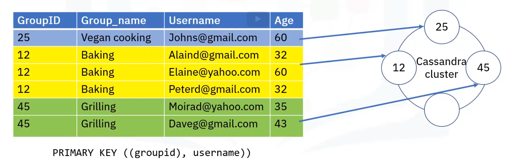

# Logical entities : Tables and keyspaces

- Table:
Logical entity that organizes data storage at cluster and node level (according to a declared schema)

- Key space:
Logical entity that contains one or more tables.
Replication and data centers distribution is defined at key space level.
Recommended one key space per application

**Create keyspace**

CREATE KEYSPACE my_keyspace WITH REPLICATION = {'class': 'NetworkTopologyStrategy', 'dataCenter1': 2, 'datacenter1':3};

USE my_keyspace

**Create table**

Similar to SQL

# Tables

Data is organized in tables containing rows of columns
Tables can be created, dropped, and altered at runtime without blocking updating and queries.
To create a table, you must define a primary key and other data columns

CREATE TABLE my_keyspace.my_table()

# Primary key in cassandra tables
Is basically a subset of the table's declared columns.
The primary key has two roles:
- Optimize read performance for table queries.
- Provide uniqueness to the entries.

The primary key has two components:
- partition key  - mandatory
- Clustering key(s) - optional

**Partition key**
When data is written to a table, it is grouped into partitions and distributed on cluster nodes - based on partition key.
Partition key => hash (token) => node
The partition key hash is used to determine what node and subsequent replicas.
Partition key determines data (partition) locality in cluster.

# Table types

- Static
Contains only the partition key and no clustering key
- dynamics
has both the partition key and the clustering key

# Clustering key

Stores data in ascending or descending order withing the partition for the fast retrieval of similar values.
The clustering column specifies the the column order that the data is arranged in inside the partition.
Can have single or multiple columns

Example 

query: "Return all users in group_id 12 with age 32"
Clustering key = age, username

CREATE TABLE key_space.my_table(
    group_id int,
    group_name text STATIC,
    username text,
    age int,
    PRIMARY KEY ((group_id), age, username));

