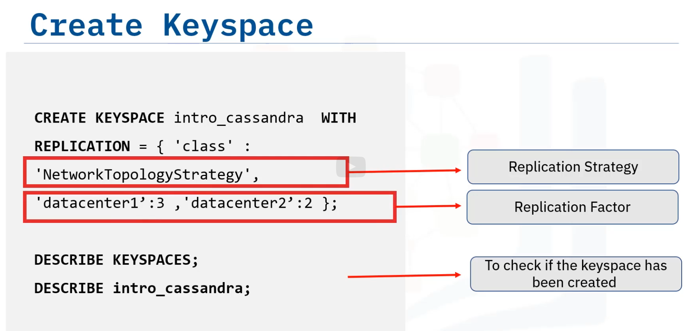

Key space needs to be defined before creating tables.
Key space can contain any number of tables, and a table belongs to only one key space.
Replication is specified atz the key space level.

# Create key space

# Data replication

- Replication factors:
Number of replicas placed on different nodes in the cluster

- Replication strategy

Which nodes are going to house the replicas

