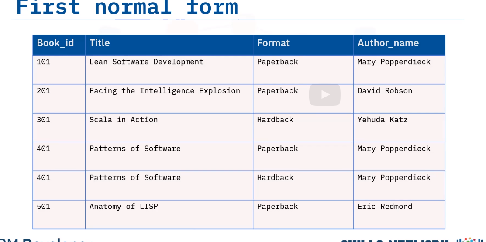
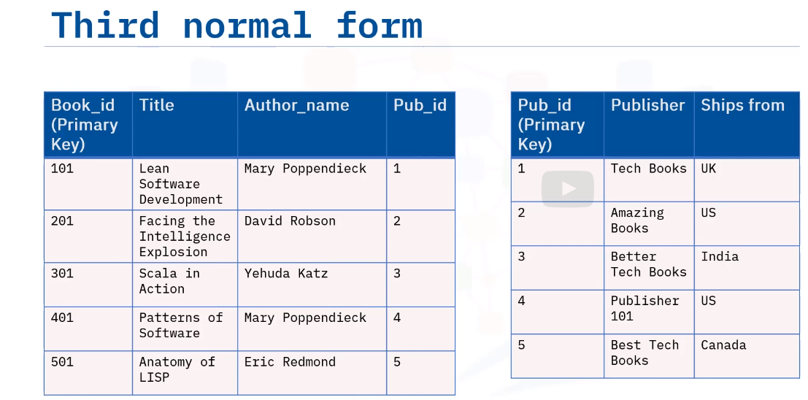

Normalization is the process of organizing your data to reduce redundant data, often by dividing larger tables into multiple related tables.
Helps speed up transactions because you perform updates, additions, and deletes.
Improve integrity.

Most used normalization forms:

- First normal from
Called "1NF"
Each row must be unique
Each cell must contain only a single value not more example a column has more than one value:
| Tile |
--------
|value1,| 
|value 2|
---------

- Second normal from
Also called "2NF"
Databases must be already in first normal form
Create separate tables for sets of values that apply to multiple rows by 

- third normal from
Also called "3NF"
The database must be already in first and second normal form.
Eliminate columns that do not depend on the key

# Normalization in OLTP and OLAP

Online Translational processing (OLTP)
-> Data is read and written frequently
-> Data is normalized or BCNF

Online Analytical processing (OLAP)
-> Data is mostly read only
-> Data is denonormalized to 2NF or 1NF