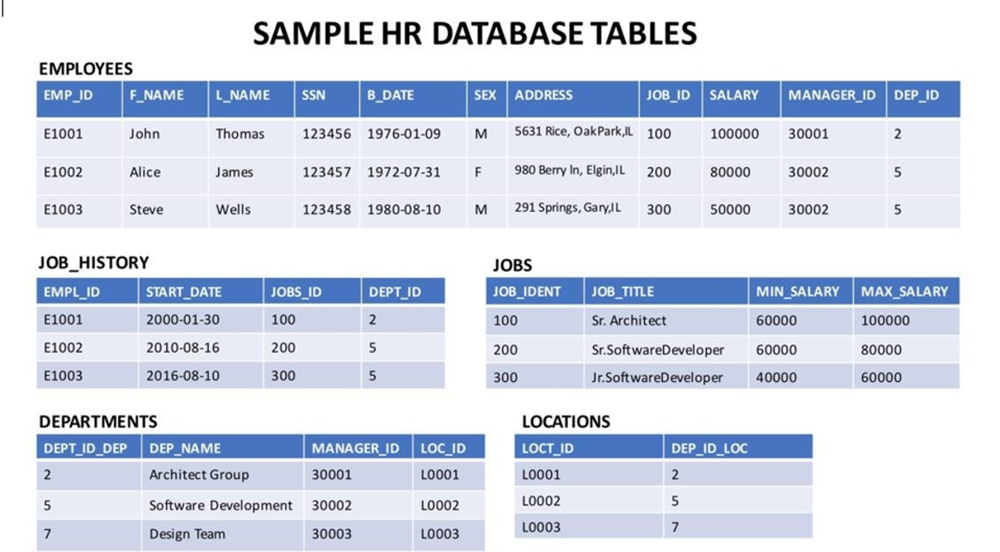

# Database used in this lab

# Accessing multiple tables with sub-queries
Let us see some examples of queries requiring multiple table access using sub-queries.

Retrieve only the EMPLOYEES records corresponding to jobs in the JOBS table.
For such a question, you can implement the sub-query in the WHERE clause, such that the overlapping column of JOD ID can identify the required entries.

1
SELECT * FROM EMPLOYEES WHERE JOB_ID IN (SELECT JOB_IDENT FROM JOBS);
Copied!
The expected output would look as shown below.

Table of data

Retrieve JOB information for employees earning over $70,000.
For this example, retrieve the details from the JOBS table, which has common IDs with those available in the EMPLOYEES table, provided the salary in the EMPLOYEES table is greater than $70,000. You can write the query as:

1
2
3
SELECT JOB_TITLE, MIN_SALARY, MAX_SALARY, JOB_IDENT
FROM JOBS
WHERE JOB_IDENT IN (select JOB_ID from EMPLOYEES where SALARY > 70000 );
Copied!
The expected output would look as shown below.

# Accessing multiple tables with Implicit Joins
Let us see some examples of queries that require access of multiple tables using Implicit Joins.

Retrieve only the EMPLOYEES records corresponding to jobs in the JOBS table.
The same question as before, but now we will use Implicit Join to retrieve the required information. For this, you will combine the tables based on job IDs. Using the following query for this:

1
2
3
SELECT *
FROM EMPLOYEES, JOBS
WHERE EMPLOYEES.JOB_ID = JOBS.JOB_IDENT;
Copied!
The expected output is shown below.

Table of data

Redo the previous query using shorter aliases for table names.
Note that the tables in question can be assigned shorter aliases. This is especially helpful in cases where specific columns are to be accessed from different tables. The query would be modified to:

1
2
3
SELECT *
FROM EMPLOYEES E, JOBS J
WHERE E.JOB_ID = J.JOB_IDENT;
Copied!
The output would look like:

Employee ID table of data

Notice that the two queries are giving the same response.
In the previous query, retrieve only the Employee ID, Name, and Job Title.
Notice that Job Title is a column of the JOBS table, and other details are coming from the EMPLOYEES table. The two tables will be joined on Job ID. The query would be as follows:

1
2
3
SELECT EMP_ID,F_NAME,L_NAME, JOB_TITLE
FROM EMPLOYEES E, JOBS J
WHERE E.JOB_ID = J.JOB_IDENT;
Copied!
The output would look as shown below.
Employee ID table of data

Redo the previous query, but specify the fully qualified column names with aliases in the SELECT clause.
The column names can also be prefixed with table aliases to keep track of where each column is coming from. The above query will be modified as shown below.

1
2
3
SELECT E.EMP_ID, E.F_NAME, E.L_NAME, J.JOB_TITLE
FROM EMPLOYEES E, JOBS J
WHERE E.JOB_ID = J.JOB_IDENT;
Copied!
The expected output is:
Employee ID table of data

